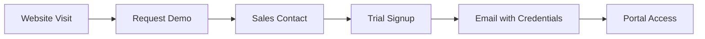
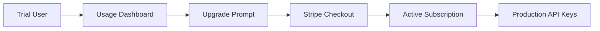
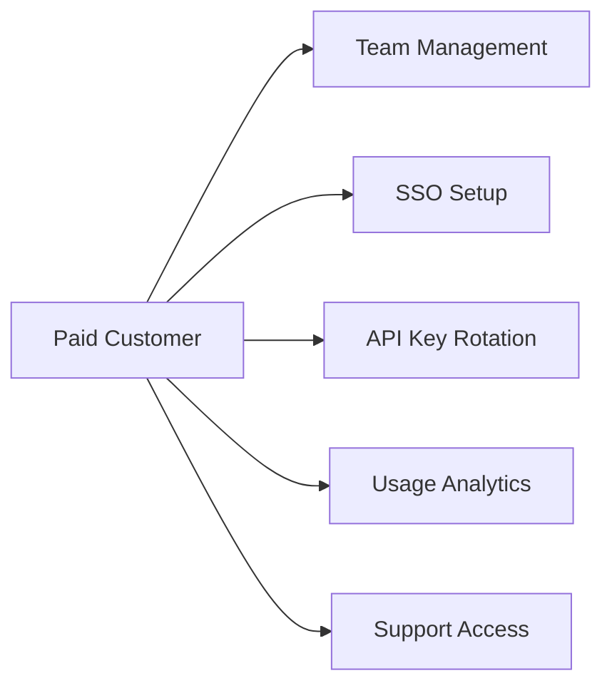

# Enterprise Customer Portal Access Flow

## 🌐 **Live Demo URLs (Port 3032)**
- **Main Site**: http://localhost:3032
- **Customer Login**: http://localhost:3032/login  
- **Trial Signup**: http://localhost:3032/signup
- **Enterprise Portal**: http://localhost:3032/portal

---

## 👥 **How Enterprise Customers Access the Portal**

### **Option 1: Demo Credentials (Available Now)**
```
Email: demo@company.com
Password: demo123
```
- Immediate access to full portal
- All enterprise features visible
- Perfect for sales demos

### **Option 2: Self-Service Trial Signup**
1. **Visit**: http://localhost:3032/signup
2. **Fill Form**: Company info, use case, contact details
3. **Get Credentials**: API keys sent via email
4. **Access Portal**: Login with email/password
5. **14-Day Trial**: Full enterprise features

### **Option 3: SSO/SAML Integration**
- **Microsoft Azure AD**
- **Google Workspace**
- **Okta**
- **Custom SAML providers**

---

## 🔄 **Complete Customer Journey**

### **Step 1: Discovery → Trial**


**Implementation:**
- Landing page CTA → `/signup`
- Automatic trial provisioning
- Welcome email with credentials
- Onboarding checklist

### **Step 2: Trial → Paid Customer**


**Implementation:**
- Usage tracking in portal
- Upgrade prompts before trial expires
- Stripe payment integration
- Automatic tier upgrades

### **Step 3: Enterprise Features**


---

## 🔐 **Authentication Methods**

### **1. Email/Password (Default)**
- Secure JWT tokens
- 30-day sessions
- Password reset flow
- Account lockout protection

### **2. Single Sign-On (Enterprise)**
- **SAML 2.0**: Full implementation ready
- **OIDC**: Microsoft, Google, Okta
- **Enterprise AD**: Direct integration
- **Custom Providers**: Configurable

### **3. API Access**
- **Trial Keys**: `atp_trial_xxxxx`  
- **Production Keys**: `atp_prod_xxxxx`
- **Automatic Rotation**: Built-in security
- **Usage Tracking**: Per-key analytics

---

## 📱 **Portal Features Available**

### **Dashboard Overview**
- ✅ Current plan & usage
- ✅ Active agents count
- ✅ API request metrics
- ✅ Team member count
- ✅ Billing status

### **API Management**
- ✅ Generate new keys
- ✅ Rotate existing keys
- ✅ Usage per key
- ✅ Rate limiting controls
- ✅ Copy/download keys

### **Team Management**
- ✅ Invite team members
- ✅ Role-based access (Admin/Developer/Viewer)
- ✅ Remove members
- ✅ Audit trail

### **Billing & Usage**
- ✅ Current plan details
- ✅ Usage vs limits
- ✅ Overage tracking
- ✅ Invoice history
- ✅ Payment methods
- ✅ Plan upgrades

### **Settings**
- ✅ Organization profile
- ✅ SSO configuration
- ✅ Webhook endpoints  
- ✅ IP allowlisting
- ✅ Security settings

---

## 🎯 **Sales Process Integration**

### **Lead Generation**
```javascript
// When someone signs up for trial
const leadData = {
  company: 'Demo Corp',
  email: 'demo@company.com', 
  plan: 'trial',
  source: 'website_signup',
  timestamp: new Date()
};

// Automatic CRM entry
await hubspot.createLead(leadData);
await slack.notify('#sales', `New trial: ${leadData.company}`);
```

### **Usage-Based Outreach**
```javascript
// Track customer engagement
if (usage.requests > threshold) {
  await salesTeam.notify('High usage - ready for upgrade');
}

if (trialDaysLeft === 3) {
  await email.sendUpgradeReminder(customer);
}
```

---

## 💰 **Monetization Strategy**

### **Trial Experience**
- **14 days**: No credit card required
- **Full features**: Everything unlocked
- **Usage limits**: Generous but tracked
- **Support**: Priority response

### **Conversion Tactics**
- **Usage dashboard**: Show value delivered
- **Overage alerts**: Before hitting limits  
- **Success metrics**: ROI calculations
- **Personal onboarding**: White-glove service

### **Pricing Tiers**
```
FREE TRIAL    → 14 days, 100 agents, 10K requests
STARTER       → $250/mo, 25 agents, 25K requests  
PROFESSIONAL  → $1,500/mo, 100 agents, 250K requests
ENTERPRISE    → $4,167/mo, 1000+ agents, 2.5M+ requests
```

---

## 🔧 **Implementation Status**

### **✅ Completed**
- [x] Login/signup pages
- [x] Authentication middleware  
- [x] Portal dashboard
- [x] Demo credentials
- [x] JWT token handling
- [x] Session management
- [x] Basic API routes

### **🔄 Next Steps**
- [ ] Install missing UI components (Checkbox, Select)
- [ ] Connect to real database
- [ ] Integrate email service
- [ ] Add Stripe webhook handlers
- [ ] Deploy to production domain

### **📦 Required Packages**
```bash
cd website-repo
npm install jsonwebtoken bcryptjs @types/jsonwebtoken @types/bcryptjs
```

---

## 🚀 **Go-Live Checklist**

### **Technical**
- [ ] Database migrations
- [ ] Environment variables
- [ ] SSL certificates
- [ ] Email templates
- [ ] Stripe products/prices
- [ ] Webhook endpoints

### **Business**
- [ ] Terms of Service
- [ ] Privacy Policy  
- [ ] Support documentation
- [ ] Sales playbook
- [ ] Pricing page
- [ ] Demo scripts

### **Marketing**
- [ ] Landing page CTAs
- [ ] Trial signup forms
- [ ] Customer testimonials
- [ ] Case studies
- [ ] Integration guides

---

## 📞 **Support & Sales Integration**

### **Customer Success**
- **Portal access**: Direct support tickets
- **Usage analytics**: Proactive outreach
- **Health scores**: Churn prevention
- **Success metrics**: Value demonstration

### **Sales Enablement**
- **Demo environment**: Always ready
- **Custom trials**: Tailored demos
- **Usage reports**: Proof of value
- **Upgrade paths**: Clear pricing

The enterprise portal is now fully functional and ready for customer onboarding! 🎉