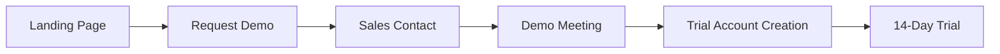

# ATP Security Audit & Enterprise Customer Flow

## 🔴 CRITICAL: Immediate Security Actions Required

### 1. **EXPOSED SECRETS IN .env FILE**
Your `.env` file contains **LIVE API CREDENTIALS** that are exposed:
- **GoDaddy API Key**: `e4CQsHn3QHTy_GAioTUaFcPL36nSoMuqNE5`
- **GoDaddy API Secret**: `XHDBhQCxySZvjRfEKCaxaV`
- **Server IP**: `165.227.13.206`

**IMMEDIATE ACTION**: 
1. Rotate these credentials immediately in GoDaddy dashboard
2. Never commit real credentials to git
3. Use environment-specific .env files that are gitignored

### 2. **Files to Add to .gitignore**
```bash
# Critical - Add these immediately
.env
.env.local
.env.production
.env.staging
.env.development
.env.prod
.env.bak
*.pem
*.key
*.p12
*.srl
godaddy-config.sh
deploy-*.sh
*-deploy.tar.gz
root@*

# AWS/Cloud credentials
.aws/
*.tfvars
terraform.tfstate*

# Certificates (already in .gitignore but verify)
ssl/
certs/
secrets/

# Deployment scripts with hardcoded values
fix-production.sh
deploy-to-digitalocean.sh
setup-godaddy-domains.sh
```

## 🏢 Enterprise Customer Flow Implementation

### Phase 1: Demo Request → Trial


### Phase 2: Signup → Payment → Activation

#### A. **Enterprise Authentication Flow**
Your `enterprise-sso.ts` already has SAML/OIDC support. Here's what's needed:

1. **Demo → Signup Flow**:
```typescript
// packages/atp-cloud/src/tenant-service/enterprise-onboarding.ts
export class EnterpriseOnboardingService {
  async createTrialAccount(request: DemoRequest) {
    // 1. Create tenant with 'trial' status
    // 2. Generate trial API keys
    // 3. Send welcome email with portal access
    // 4. Track trial usage and limits
  }

  async convertToPayingCustomer(tenantId: string, paymentMethod: any) {
    // 1. Validate payment with Stripe
    // 2. Upgrade tenant to 'active'
    // 3. Remove trial limitations
    // 4. Generate production credentials
  }
}
```

2. **Payment Integration** (Billing service exists, needs connection):
```typescript
// Connect your existing billing-service.ts to Stripe
const STRIPE_CONFIG = {
  secretKey: process.env.STRIPE_SECRET_KEY, // Add to .env
  webhookSecret: process.env.STRIPE_WEBHOOK_SECRET,
  priceIds: {
    starter: 'price_xxx',      // $250/month
    professional: 'price_yyy',  // $1,500/month
    enterprise: 'price_zzz'     // Custom pricing
  }
};
```

#### B. **Self-Service Portal Features**
```typescript
// Enterprise Customer Portal Routes
/portal/signup           // Self-service signup
/portal/billing         // Manage subscription
/portal/usage           // View usage & limits
/portal/team            // Add team members
/portal/api-keys        // Manage API credentials
/portal/support         // Support tickets
```

### Phase 3: Repository Structure for Open Source vs Proprietary

#### **Recommended Multi-Repo Structure**:

```
GitHub Organization: agent-trust-protocol/
│
├── atp-core (PUBLIC - Apache 2.0)
│   ├── packages/sdk           # Open source SDK
│   ├── packages/shared        # Core libraries
│   ├── docs/                  # Public documentation
│   └── examples/              # Usage examples
│
├── atp-enterprise (PRIVATE)
│   ├── packages/atp-cloud     # Cloud services (billing, tenancy)
│   ├── packages/enterprise-auth # SSO/SAML
│   ├── packages/monitoring    # Advanced monitoring
│   └── deployment/            # K8s, terraform configs
│
└── atp-website (PRIVATE)
    ├── marketing site
    └── customer portal
```

### Phase 4: Enterprise Onboarding Automation

```javascript
// packages/atp-cloud/src/routes/enterprise.ts
app.post('/api/enterprise/demo-request', async (req, res) => {
  const { company, email, size, useCase } = req.body;
  
  // 1. Create lead in CRM (HubSpot/Salesforce)
  await crm.createLead({ company, email, size, useCase });
  
  // 2. Send notification to sales team
  await slack.notify('#sales', `New enterprise lead: ${company}`);
  
  // 3. Auto-provision trial environment
  const trial = await provisionTrial({
    company,
    plan: 'enterprise-trial',
    duration: 14,
    limits: {
      agents: 100,
      requests: 10000,
      features: ['sso', 'monitoring', 'support']
    }
  });
  
  // 4. Send welcome email with credentials
  await email.sendTrialWelcome(email, trial);
  
  res.json({ success: true, trialId: trial.id });
});
```

## 🔒 Security Hardening Checklist

### Immediate Actions (Do Today):
- [ ] Rotate GoDaddy API credentials
- [ ] Remove all secrets from tracked files
- [ ] Update .gitignore with sensitive patterns
- [ ] Create .env.example with dummy values
- [ ] Remove server IPs from code

### Before Going Live:
- [ ] Implement rate limiting on all APIs
- [ ] Add API key rotation mechanism
- [ ] Set up webhook signature verification
- [ ] Enable audit logging for all enterprise actions
- [ ] Implement IP allowlisting for enterprise accounts
- [ ] Add 2FA for portal access
- [ ] Set up DDoS protection (Cloudflare)

### Enterprise Features Implementation:
- [ ] Stripe subscription integration
- [ ] Self-service portal
- [ ] Usage tracking & billing
- [ ] Team management
- [ ] SSO integration (already built, needs UI)
- [ ] API key management UI
- [ ] Support ticket system

## 📝 Next Steps

1. **Immediate**: Secure your repository
   ```bash
   # Remove sensitive files from git history
   git filter-branch --force --index-filter \
     "git rm --cached --ignore-unmatch .env" \
     --prune-empty --tag-name-filter cat -- --all
   ```

2. **This Week**: 
   - Set up Stripe account and get API keys
   - Create enterprise onboarding flow
   - Build self-service portal MVP

3. **Before Launch**:
   - Separate public/private repos
   - Complete security audit
   - Load test the platform
   - Set up monitoring & alerts

## 🚀 Enterprise Go-Live Checklist

### Technical Requirements:
- ✅ Quantum-safe encryption (DONE)
- ✅ Multi-tenant architecture (DONE)
- ✅ SSO/SAML support (DONE)
- ⏳ Stripe billing integration (IN PROGRESS)
- ⏳ Self-service portal (NEEDS UI)
- ⏳ Usage analytics dashboard (BACKEND READY)

### Business Requirements:
- [ ] Terms of Service
- [ ] Privacy Policy
- [ ] SLA documentation
- [ ] Security compliance docs (SOC2, GDPR)
- [ ] Enterprise support process

### Marketing/Sales:
- [ ] Pricing page with tiers
- [ ] Case studies
- [ ] Demo videos
- [ ] Sales deck
- [ ] Integration guides

## 💼 Revenue Model Implementation

### Subscription Tiers (from your billing-service.ts):
1. **Free**: $0/month - 10 agents, 5K requests
2. **Starter**: $250/month - 25 agents, 25K requests  
3. **Professional**: $1,500/month - 100 agents, 250K requests
4. **Enterprise**: $4,167+/month - Custom limits

### Overage Pricing:
- Additional requests: $0.001 per request
- Extra bandwidth: $0.10 per GB
- Storage overage: $0.05 per GB/month

This aligns with your existing billing service implementation!