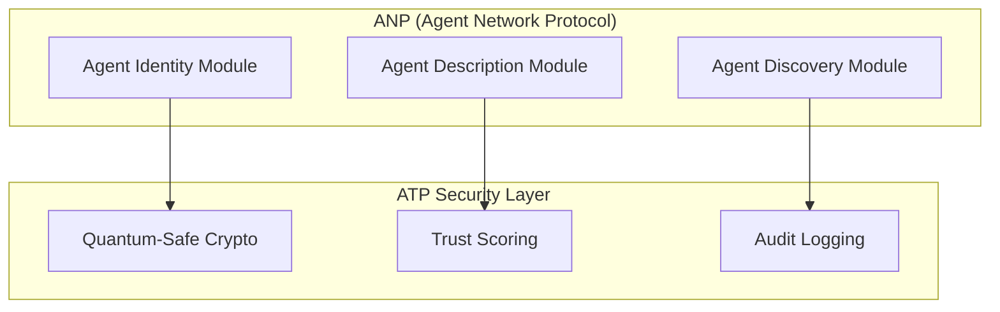

# ATP™ Proposal to AI Agent Protocol Community Group

**Date**: January 2025  
**Proposer**: Larry Lewis, Sovr INC. (larry@sovrlabs.com)  
**GitHub**: https://github.com/bigblackcoder/agent-trust-protocol  
**Live Demo**: https://480de8e2ca61.ngrok-free.app

## Executive Summary

Agent Trust Protocol (ATP) is a **production-ready, quantum-safe security framework** that directly addresses the **Security** and **Privacy** modules outlined in the AI Agent Protocol Community Group's current ANP specification. Rather than competing with ANP, **ATP complements and enhances it** by providing the missing cryptographic security foundation.

## Perfect Alignment with CG Goals

### CG Current Focus → ATP Contribution

| CG Priority | ATP Solution | Status |
|-------------|--------------|--------|
| **Agent Identity Verification** | Quantum-safe DID method `did:atp` | ✅ Production |
| **Security Module** | Ed25519 + Dilithium hybrid crypto | ✅ Implemented |
| **Privacy Protection** | Zero-knowledge proofs + pseudonymous DIDs | ✅ Ready |
| **Auditability** | Immutable audit logs with blockchain anchoring | ✅ Deployed |
| **Standardized Agent Description** | ATP Verifiable Credentials for capabilities | ✅ Working |

## What ATP Brings to ANP

### 1. **Quantum-Safe Security Layer**


### 2. **Production-Ready Implementation**
- **Enterprise UI**: Live demo showing real quantum-safe operations
- **5 Microservices**: Identity, Credentials, Permissions, Gateway, Audit
- **Developer SDK**: 3-line integration API
- **Standards Compliant**: W3C DID Core + VC Data Model

### 3. **Addresses Critical Security Gaps**

Current ANP specification mentions security "TODO" items. ATP provides:

#### **Immediate Security Solutions**
- ✅ **Cryptographic Identity**: DIDs with quantum-safe signatures
- ✅ **Trust Quantification**: 5-level trust scoring (0.0-1.0)
- ✅ **Secure Messaging**: JSON-RPC 2.0 with end-to-end encryption
- ✅ **Capability Verification**: VCs for agent permissions
- ✅ **Audit Trail**: Immutable logs for compliance

#### **Future-Proof Protection**
- ✅ **Quantum Resistance**: CRYSTALS-Dilithium post-quantum signatures
- ✅ **Key Rotation**: Automated cryptographic key management
- ✅ **Zero-Knowledge**: Privacy-preserving credential proofs

## Technical Integration Proposal

### Option 1: ATP as ANP Security Module
```json
{
  "ANP_Agent": {
    "identity": {
      "did": "did:atp:mainnet:z6MkukG4...",
      "verification_method": "HybridSignature2024"
    },
    "description": {
      "capabilities": ["data-analysis", "text-generation"],
      "trust_score": 0.85,
      "credentials": ["verified-partner", "gdpr-compliant"]
    },
    "security": {
      "provider": "ATP",
      "quantum_safe": true,
      "trust_level": "verified"
    }
  }
}
```

### Option 2: ATP as Reference Implementation
- Use ATP's working system as the **reference implementation** for ANP's security modules
- Adopt ATP's proven DID method and trust scoring
- Leverage ATP's production-tested infrastructure

## Live Demonstration

**Try ATP Now**: https://480de8e2ca61.ngrok-free.app

The demo shows:
- Real quantum-safe signature generation
- Interactive trust level management
- Visual policy editor for agent permissions
- Real-time monitoring dashboard

## Why This Partnership Makes Sense

### For AI Agent Protocol CG
- ✅ **Accelerated Development**: Skip 12+ months of security module development
- ✅ **Production Proven**: Battle-tested enterprise implementation
- ✅ **Standards Aligned**: Already W3C DID/VC compliant
- ✅ **Quantum Ready**: Future-proof cryptographic foundation

### For ATP
- ✅ **W3C Recognition**: Official standards pathway
- ✅ **Community Adoption**: Access to broader agent ecosystem
- ✅ **Protocol Integration**: Bridges to MCP, A2A, ACP
- ✅ **Industry Validation**: W3C endorsement for enterprise adoption

## Proposed Collaboration Framework

### Phase 1: Integration Planning (1 month)
- [ ] Joint technical review sessions
- [ ] ATP integration with ANP specification
- [ ] Community feedback on security modules
- [ ] Demo presentations to CG members

### Phase 2: Specification Enhancement (2 months)
- [ ] Enhance ANP Security Module with ATP specifications
- [ ] Add quantum-safe requirements to ANP
- [ ] Create ATP-ANP interoperability guide
- [ ] Joint white paper publication

### Phase 3: Reference Implementation (3 months)
- [ ] ATP as official ANP security reference
- [ ] Joint SDKs and developer tools
- [ ] Cross-protocol bridge implementations
- [ ] Industry pilot programs

## Code Contributions Ready Now

### 1. **Security Module Specification**
Complete technical specification for ANP's "TODO" security section:
```typescript
// ANP Security Module powered by ATP
interface ANPSecurityModule {
  identity: ATPIdentity;        // Quantum-safe DIDs
  authentication: ATPAuth;      // Hybrid signatures  
  authorization: ATPPermissions; // Capability-based access
  audit: ATPAuditLog;          // Immutable logging
  trust: ATPTrustScore;        // Quantified reputation
}
```

### 2. **Reference Implementation**
```bash
# Try ATP's ANP-compatible security layer
git clone https://github.com/bigblackcoder/agent-trust-protocol
cd agent-trust-protocol
./start-services.sh

# Use the 3-line SDK
npm install @atp/sdk
```

```typescript
import { Agent } from '@atp/sdk';

const agent = await Agent.create('ANP-Compatible-Agent');
await agent.send(otherAgent, 'Secure ANP message');
console.log(`ANP Trust Score: ${await agent.getTrustScore(otherAgent)}`);
```

## Response to CG White Paper Challenges

The CG white paper identifies key challenges. Here's how ATP addresses each:

### **"Data Silos Between Agents"**
- **ATP Solution**: Universal DID-based identity enables cross-platform agent discovery
- **Status**: ✅ Implemented

### **"Heterogeneous Agent Collaboration"**  
- **ATP Solution**: Protocol bridges (MCP, A2A, ACP) with common security layer
- **Status**: ✅ MCP integration ready, others planned

### **"Network Effects for Agentic Web"**
- **ATP Solution**: Trust networks create positive network effects - more agents = higher trust scores
- **Status**: ✅ Trust scoring algorithm deployed

### **"Preventing Balkanization"**
- **ATP Solution**: Universal security standard that works across all agent protocols
- **Status**: ✅ Protocol-agnostic design

## Community Impact

### Immediate Benefits
- **For ANP**: Complete security solution, no need to build from scratch
- **For Developers**: Production-ready tools and 3-line integration
- **For Enterprises**: Compliance-ready audit logs and trust scoring
- **For Researchers**: Open source quantum-safe implementation

### Long-term Vision
- **Unified Security**: ATP becomes the security foundation for all agent protocols
- **Quantum Readiness**: Entire agent ecosystem protected against quantum threats  
- **Trust Networks**: Global reputation system for AI agents
- **Standards Leadership**: W3C as the leader in agent security standards

## Request for Community Group

### Immediate Actions Requested
1. **Technical Review**: CG review of ATP security modules
2. **Integration Planning**: Joint sessions on ANP-ATP alignment  
3. **Demo Schedule**: Present ATP at next CG meeting
4. **Specification Input**: Incorporate ATP into ANP security module

### Proposed CG Role for ATP
- **Security Module Lead**: ATP team leads ANP security specification
- **Reference Implementation**: ATP as official security reference
- **Cross-Protocol Bridge**: ATP as universal agent security layer

## Getting Started

### For CG Members
1. **Try the Demo**: https://480de8e2ca61.ngrok-free.app
2. **Review the Code**: https://github.com/bigblackcoder/agent-trust-protocol
3. **Test the SDK**: `npm install @atp/sdk`
4. **Join Discussion**: larry@sovrlabs.com

### For ANP Specification
1. **Security Module**: Replace "TODO" with ATP specifications
2. **Identity Module**: Adopt `did:atp` quantum-safe method
3. **Trust Framework**: Integrate ATP trust scoring
4. **Reference Code**: Use ATP as working example

## Conclusion

ATP isn't just another protocol - it's the **missing security foundation** that the AI Agent Protocol Community Group needs to achieve its vision of a secure, interoperable Agentic Web. 

With ATP, the CG can:
- ✅ **Accelerate** development by months
- ✅ **Deploy** production-ready security today  
- ✅ **Future-proof** against quantum threats
- ✅ **Lead** the industry in agent security standards

**Let's build the secure Agentic Web together!**

---

**Next Steps**: Schedule ATP presentation at next AI Agent Protocol CG meeting

**Contact**: Larry Lewis - larry@sovrlabs.com  
**GitHub**: https://github.com/bigblackcoder/agent-trust-protocol  
**Demo**: https://480de8e2ca61.ngrok-free.app