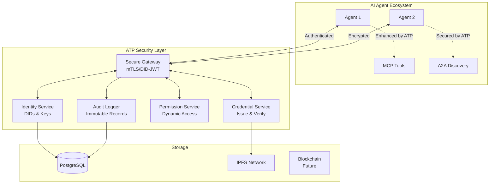

# Agent Trust Protocol Architecture

The Agent Trust Protocol (ATP) implements a modular, five-component security architecture designed to provide a comprehensive trust layer for AI agent ecosystems.

## System Architecture

ATP consists of the following core components:



## Core Components

### 1. Identity Service

The Identity Service manages decentralized identifiers (DIDs) for agents, providing:

- DID creation and registration
- Cryptographic key management
- DID resolution and verification
- Key rotation and recovery

The service implements the W3C DID Core specification, supporting the `did:atp` method.

### 2. Credential Service

The Credential Service handles verifiable credentials (VCs) for agent capabilities:

- Credential issuance and verification
- Schema management and validation
- Credential revocation
- Selective disclosure

The service implements the W3C Verifiable Credentials Data Model.

### 3. Permission Service

The Permission Service manages access control and capabilities:

- Capability-based access control
- Policy enforcement
- Time-bound permission tokens
- Trust level management

### 4. Secure Gateway

The Secure Gateway facilitates secure communication between agents:

- JSON-RPC 2.0 over WebSocket
- mTLS with DID-based certificates
- DID-JWT authentication
- Message routing and load balancing
- Protocol translation

### 5. Audit Logger

The Audit Logger maintains immutable records of all interactions:

- Hash-linked event logs
- Cryptographic proof of events
- Compliance reporting
- Anomaly detection

## Trust Levels

ATP implements a multi-level trust system:

```typescript
enum TrustLevel {
  UNKNOWN = 0,      // No verification
  BASIC = 0.25,     // Identity verified
  VERIFIED = 0.5,   // Credentials validated
  TRUSTED = 0.75,   // Full collaboration
  PRIVILEGED = 1.0  // Administrative access
}
```

## Protocol Integrations

ATP is designed to integrate with other AI agent protocols:

- **MCP (Anthropic)**: Secure tool access with verifiable credentials
- **A2A (Google)**: Trust scoring for agent relationships
- **ACP (IBM)**: Authentication layer for agent communication
- **AGP (Cisco)**: Secure multi-tenant agent networks
- **ANP**: Identity verification for cross-domain interoperability
- **AGORA (Oxford)**: Secure protocol negotiation

## Security Model

ATP implements a comprehensive security model:

- **End-to-End Encryption**: AES-256-GCM + TLS 1.3
- **Mutual Authentication**: mTLS with DID-based certificates
- **Zero-Knowledge Proofs**: Privacy-preserving credentials (roadmap)
- **Audit Trail**: Immutable, hash-linked event logs
- **Threat Mitigation**: Protection against identity spoofing, replay attacks, and permission escalation

## Storage

ATP supports multiple storage backends:

- **PostgreSQL**: Primary database for identity and permissions
- **IPFS**: Distributed storage for verifiable credentials
- **Blockchain**: Future integration for trust registry (roadmap)

## Performance

ATP is designed for high performance:

| Operation | Latency | Throughput |
|-----------|---------|------------|
| DID Registration | 45ms | 20k/sec |
| VC Verification | 15ms | 60k/sec |
| Trust Handshake | 85ms | 10k/sec |
| Secure Message | 12ms | 80k/sec |

## Deployment

ATP can be deployed in various configurations:

- **Docker**: Containerized deployment with Docker Compose
- **Kubernetes**: Scalable deployment with Kubernetes
- **Serverless**: Cloud function deployment for specific components
- **Hybrid**: Mix of deployment models based on requirements

For detailed deployment instructions, see the [Deployment Guide](deployment.md).# Agent Trust Protocol Architecture

The Agent Trust Protocol (ATP) implements a modular, five-component security architecture designed to provide a comprehensive trust layer for AI agent ecosystems.

## System Architecture

ATP consists of the following core components:


## Core Components

### 1. Identity Service

The Identity Service manages decentralized identifiers (DIDs) for agents, providing:

- DID creation and registration
- Cryptographic key management
- DID resolution and verification
- Key rotation and recovery

The service implements the W3C DID Core specification, supporting the `did:atp` method.

### 2. Credential Service

The Credential Service handles verifiable credentials (VCs) for agent capabilities:

- Credential issuance and verification
- Schema management and validation
- Credential revocation
- Selective disclosure

The service implements the W3C Verifiable Credentials Data Model.

### 3. Permission Service

The Permission Service manages access control and capabilities:

- Capability-based access control
- Policy enforcement
- Time-bound permission tokens
- Trust level management

### 4. Secure Gateway

The Secure Gateway facilitates secure communication between agents:

- JSON-RPC 2.0 over WebSocket
- mTLS with DID-based certificates
- DID-JWT authentication
- Message routing and load balancing
- Protocol translation

### 5. Audit Logger

The Audit Logger maintains immutable records of all interactions:

- Hash-linked event logs
- Cryptographic proof of events
- Compliance reporting
- Anomaly detection

## Trust Levels

ATP implements a multi-level trust system:

```typescript
enum TrustLevel {
  UNKNOWN = 0,      // No verification
  BASIC = 0.25,     // Identity verified
  VERIFIED = 0.5,   // Credentials validated
  TRUSTED = 0.75,   // Full collaboration
  PRIVILEGED = 1.0  // Administrative access
}
```

## Protocol Integrations

ATP is designed to integrate with other AI agent protocols:

- **MCP (Anthropic)**: Secure tool access with verifiable credentials
- **A2A (Google)**: Trust scoring for agent relationships
- **ACP (IBM)**: Authentication layer for agent communication
- **AGP (Cisco)**: Secure multi-tenant agent networks
- **ANP**: Identity verification for cross-domain interoperability
- **AGORA (Oxford)**: Secure protocol negotiation

## Security Model

ATP implements a comprehensive security model:

- **End-to-End Encryption**: AES-256-GCM + TLS 1.3
- **Mutual Authentication**: mTLS with DID-based certificates
- **Zero-Knowledge Proofs**: Privacy-preserving credentials (roadmap)
- **Audit Trail**: Immutable, hash-linked event logs
- **Threat Mitigation**: Protection against identity spoofing, replay attacks, and permission escalation

## Storage

ATP supports multiple storage backends:

- **PostgreSQL**: Primary database for identity and permissions
- **IPFS**: Distributed storage for verifiable credentials
- **Blockchain**: Future integration for trust registry (roadmap)

## Performance

ATP is designed for high performance:

| Operation | Latency | Throughput |
|-----------|---------|------------|
| DID Registration | 45ms | 20k/sec |
| VC Verification | 15ms | 60k/sec |
| Trust Handshake | 85ms | 10k/sec |
| Secure Message | 12ms | 80k/sec |

## Deployment

ATP can be deployed in various configurations:

- **Docker**: Containerized deployment with Docker Compose
- **Kubernetes**: Scalable deployment with Kubernetes
- **Serverless**: Cloud function deployment for specific components
- **Hybrid**: Mix of deployment models based on requirements

For detailed deployment instructions, see the [Deployment Guide](deployment.md).